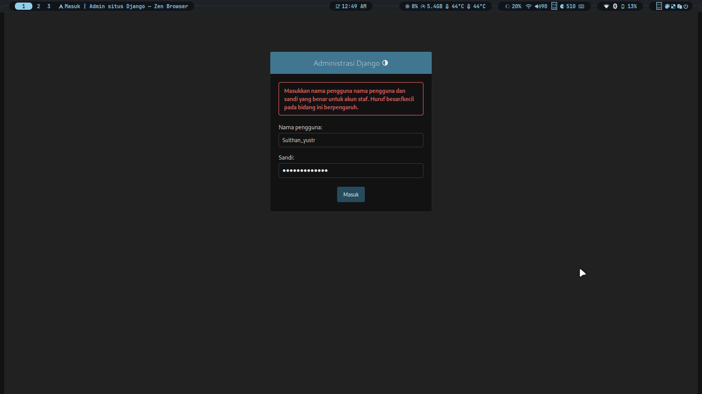
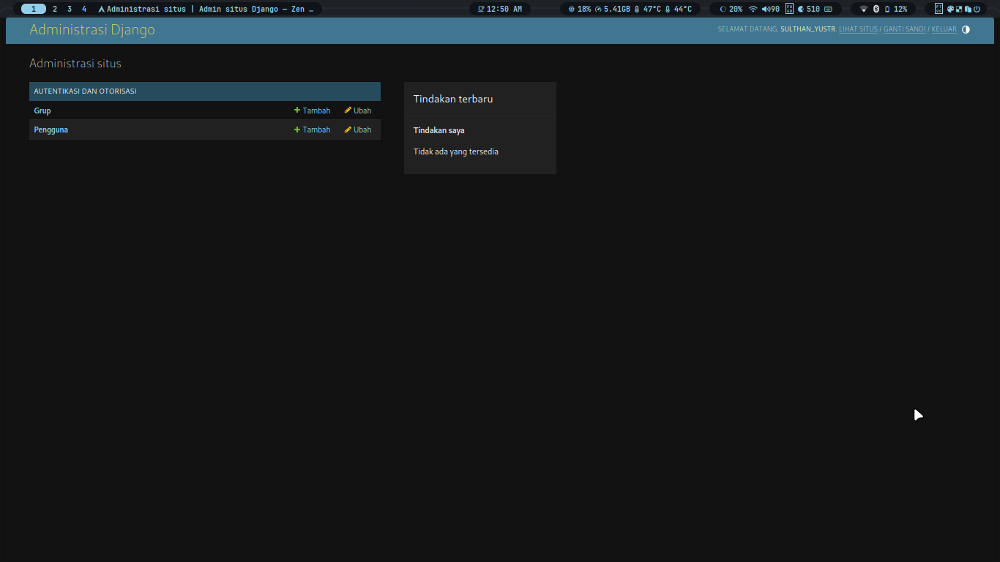
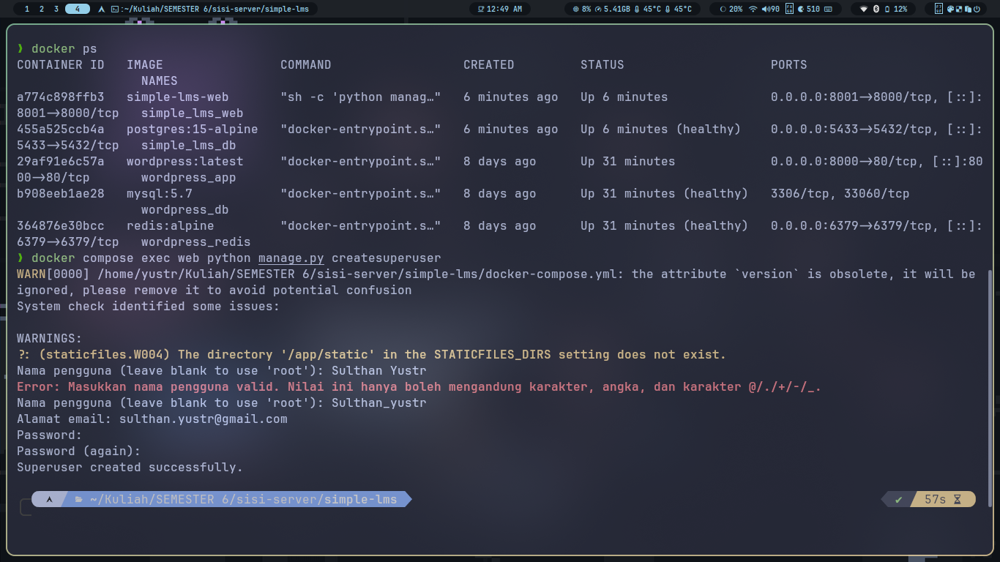

# 📚 Simple LMS — Learning Management System

> Project Django dengan Docker untuk mata kuliah Pemrograman Web Lanjut

---

## 🗂️ Project Structure

```
simple-lms/
├── docker-compose.yml
├── Dockerfile
├── .env.example
├── .gitignore
├── requirements.txt
├── manage.py
├── config/
│   ├── __init__.py
│   ├── settings.py
│   ├── urls.py
│   └── wsgi.py
└── README.md
```

---

## ⚙️ Environment Variables

Salin file `.env.example` menjadi `.env` sebelum menjalankan project:

```bash
cp .env.example .env
```

### Contoh konfigurasi `.env`:

```env
SECRET_KEY=your-secret-key
DEBUG=True
ALLOWED_HOSTS=localhost,127.0.0.1

DB_NAME=lms_db
DB_USER=postgres
DB_PASSWORD=postgres
DB_HOST=db
DB_PORT=5432
```

---

## 🚀 Cara Menjalankan Project

### Prasyarat

Pastikan sudah terinstall:

* Docker
* Docker Compose

---

### 1. Clone Repository

```bash
git clone https://github.com/username/simple-lms.git
cd simple-lms
```

---

### 2. Setup Environment

```bash
cp .env.example .env
```

---

### 3. Build & Jalankan Container

```bash
docker compose up --build
```

---

### 4. Jalankan Migrasi Database

Buka terminal baru:

```bash
docker compose exec web python manage.py migrate
```

---

### 5. Akses Aplikasi

Buka browser:

```
http://localhost:8001
```

Admin panel:

```
http://localhost:8001/admin
```

---

## 🛠️ Perintah Berguna

### Jalankan di background

```bash
docker compose up -d
```

### Melihat logs

```bash
docker compose logs -f web
docker compose logs -f db
```

### Masuk ke container

```bash
docker compose exec web bash
```

### Django shell

```bash
docker compose exec web python manage.py shell
```

### Membuat superuser

```bash
docker compose exec web python manage.py createsuperuser
```

### Migrasi database

```bash
docker compose exec web python manage.py makemigrations
docker compose exec web python manage.py migrate
```

### Stop container

```bash
docker compose down
```

### Reset database

```bash
docker compose down -v
```

---

## 🐳 Docker Services

| Service | Image       | Port | Keterangan          |
| ------- | ----------- | ---- | ------------------- |
| web     | Python 3.11 | 8001 | Django application  |
| db      | postgres:15 | 5433 | PostgreSQL database |

---

## 🔗 Tech Stack

* Django 4.2
* PostgreSQL 15
* Docker & Docker Compose

---

## 📸 Screenshot

### Halaman Utama


### Halaman Admin


### Docker Running


## ⚠️ Catatan Penting

* File `.env` tidak boleh di-commit
* Gunakan `postgres` sebagai user database untuk development
* Gunakan port `8001` karena port 8000 sudah digunakan
* Ganti `SECRET_KEY` saat production
* Set `DEBUG=False` saat production

---

## 👨‍💻 Author

Nama: Sulthan Yustr Suwardhi

---
