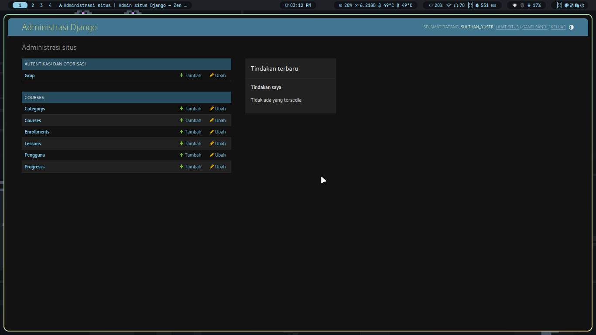
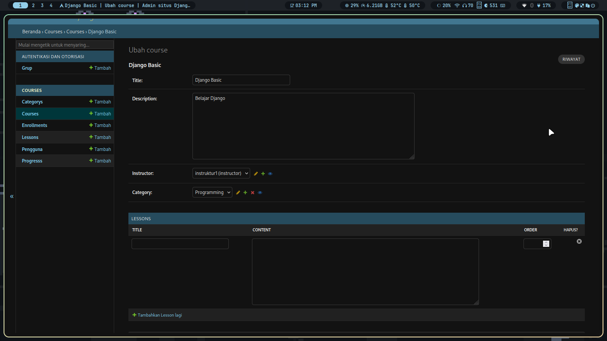
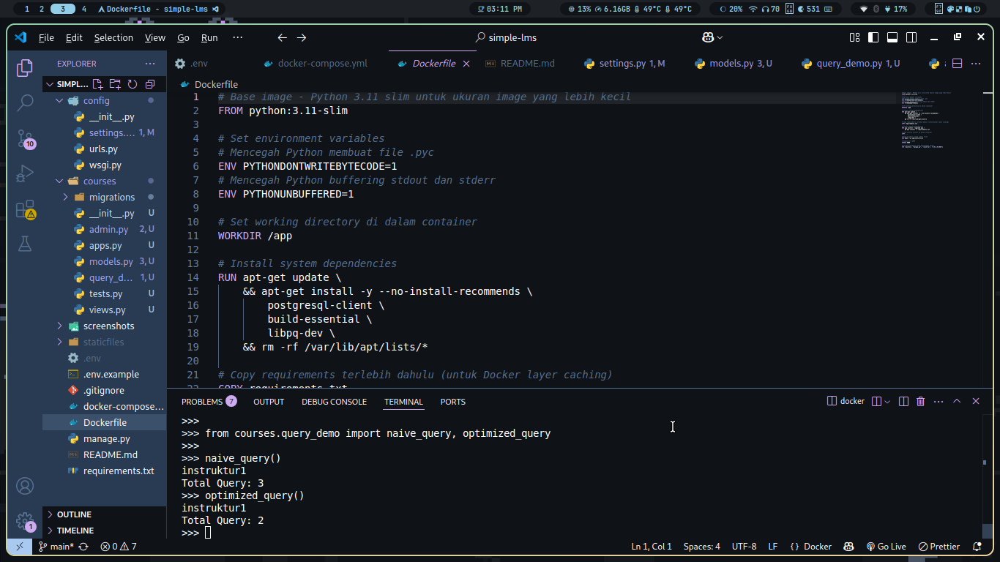

# 📚 Simple LMS — Learning Management System

> Project Django dengan Docker untuk mata kuliah Pemrograman Web Lanjut

## 📋 Daftar Isi

- [Project Structure](#-project-structure)
- [Setup & Installation](#-cara-menjalankan-project)
- [Tugas 1: Docker & Django Setup](#-tugas-1-docker--django-setup)
- [Tugas 2: Data Models & ORM Optimization](#-tugas-2-data-models--orm-optimization)
- [Tech Stack](#-tech-stack)
- [Author](#-author)

--
---

## 🗂️ Project Structure

```
simple-lms/
├── docker-compose.yml
├── Dockerfile
├── .env.example
├── .gitignore
├── requirements.txt
├── manage.py
├── config/
│ ├── init.py
│ ├── settings.py
│ ├── urls.py
│ └── wsgi.py
├── courses/ # Aplikasi utama LMS
│ ├── init.py
│ ├── models.py
│ ├── admin.py
│ ├── query_demo.py
│ └── migrations/
└── README.md
```

---

## ⚙️ Environment Variables

Salin file `.env.example` menjadi `.env` sebelum menjalankan project:

```bash
cp .env.example .env
```

### Contoh konfigurasi `.env`:

```env
SECRET_KEY=your-secret-key
DEBUG=True
ALLOWED_HOSTS=localhost,127.0.0.1

DB_NAME=lms_db
DB_USER=postgres
DB_PASSWORD=postgres
DB_HOST=db
DB_PORT=5432
```

---

## 🚀 Cara Menjalankan Project

### Prasyarat

Pastikan sudah terinstall:

* Docker
* Docker Compose

---

### 1. Clone Repository

```bash
git clone https://github.com/username/simple-lms.git
cd simple-lms
```

---

### 2. Setup Environment

```bash
cp .env.example .env
```

---

### 3. Build & Jalankan Container

```bash
docker compose up --build
```

---

### 4. Jalankan Migrasi Database

Buka terminal baru:

```bash
docker compose exec web python manage.py migrate
```

---

### 5. Akses Aplikasi

Buka browser:

```
http://localhost:8001
```

Admin panel:

```
http://localhost:8001/admin
```

---

## 🛠️ Perintah Berguna

### Jalankan di background

```bash
docker compose up -d
```

### Melihat logs

```bash
docker compose logs -f web
docker compose logs -f db
```

### Masuk ke container

```bash
docker compose exec web bash
```

### Django shell

```bash
docker compose exec web python manage.py shell
```

### Membuat superuser

```bash
docker compose exec web python manage.py createsuperuser
```

### Migrasi database

```bash
docker compose exec web python manage.py makemigrations
docker compose exec web python manage.py migrate
```

### Stop container

```bash
docker compose down
```

### Reset database

```bash
docker compose down -v
```

---

## 🐳 Docker Services

| Service | Image       | Port | Keterangan          |
| ------- | ----------- | ---- | ------------------- |
| web     | Python 3.11 | 8001 | Django application  |
| db      | postgres:15 | 5433 | PostgreSQL database |

---

## 🔗 Tech Stack

* Django 4.2
* PostgreSQL 15
* Docker & Docker Compose

---

## 📸 Screenshot

### Halaman Utama


### Halaman Admin


### Docker Running


## ⚠️ Catatan Penting

* File `.env` tidak boleh di-commit
* Gunakan `postgres` sebagai user database untuk development
* Gunakan port `8001` karena port 8000 sudah digunakan
* Ganti `SECRET_KEY` saat production
* Set `DEBUG=False` saat production

---

📝 Tugas 2: Data Models & ORM Optimization
✅ Data Models (6 tabel sesuai requirement)
Model	Deskripsi	Relasi
User	Custom user dengan role (admin/instructor/student)	-
Category	Self-referencing untuk hierarchy kategori	parent → Category
Course	Course dengan instructor dan category	instructor → User, category → Category
Lesson	Lesson dalam course dengan ordering	course → Course
Enrollment	Pendaftaran student ke course	student → User, course → Course
Progress	Tracking completion lesson per enrollment	enrollment → Enrollment, lesson → Lesson
⚡ Query Optimization

Custom Managers yang dibuat:
python

# Course.objects.for_listing()
Course.objects.select_related('instructor', 'category')
               .prefetch_related('lessons')

# Enrollment.objects.for_student_dashboard()
Enrollment.objects.select_related('student', 'course')
                  .prefetch_related('progress_set__lesson')

📊 Demo Query Optimization (N+1 Problem)

Hasil perbandingan:
text

=== NAIVE QUERY ===
instruktur1
Total Query: 3

=== OPTIMIZED QUERY ===
instruktur1
Total Query: 2

Query Type	Total Query	Keterangan
Naive Query	3 queries	Mengalami N+1 problem
Optimized Query	2 queries	Menggunakan select_related

Kesimpulan: Dengan menggunakan select_related, query dapat dioptimasi dari 3 menjadi 2 query, menghindari N+1 problem.
🎛️ Django Admin Configuration
Fitur	Implementasi
List display	✅ Username, email, role, title, instructor
Search fields	✅ Search by title, username, email
List filter	✅ Filter by role, category, status
Inline models	✅ LessonInline di dalam Course

## 📸 Screenshot
### Dashboard Admin	

### Inline Lesson di Course	

### Query Optimization Demo	


🔄 Migration & Fixtures

# Buat migration
docker compose exec web python manage.py makemigrations

# Jalankan migration
docker compose exec web python manage.py migrate

# Load fixtures (opsional)
docker compose exec web python manage.py loaddata initial_data

🐳 Docker Services
Service	Image	Port	Keterangan
web	Python 3.11-slim	8001	Django application
db	postgres:15-alpine	5433	PostgreSQL database

## 👨‍💻 Author

Nama: Sulthan Yustr Suwardhi

---
